# State of the Testers

------

# Hi

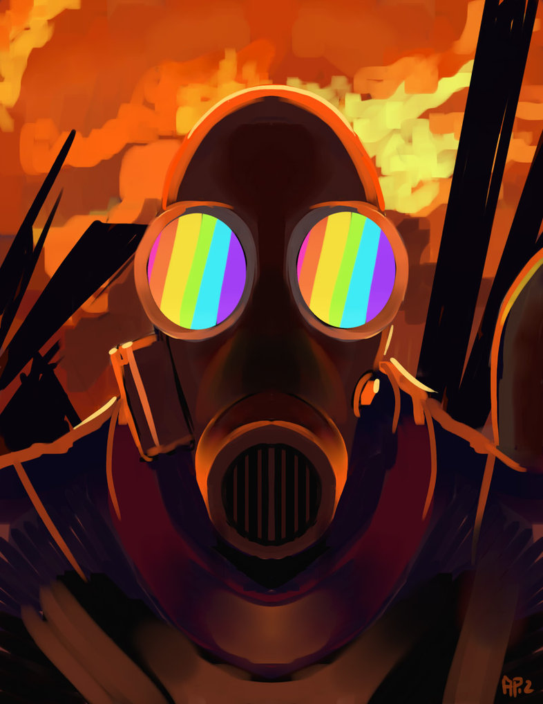

preaction

---

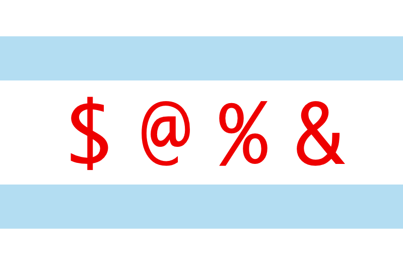

# Chicago.PM

------

# CPANTesters Project

---

# Tests CPAN

---

# Tests Perl against CPAN

---

# Variety of Tests

* OSes
* Perl versions
* Prereq versions
* Edge cases

---

# Testing Culture

---

# Compatibility Culture

---

# Stability Culture

---

# Uniquely Perl

------

# State of the Testers

------

# CPANTesters is Up

---

# Great Crash of 2015

---

# Database + Broken HD = :(

750G MyISAM Database

------

# New Server

---

# Mostly Working

------

# Future Plans

---

# New Web App

Modern web design and features

---

# Improve Stability

No single point of failure

---

# More Testers

Easier to set up and maintain tester boxes

------

# We Need You

... and fewer cliches

---

# Project Tracking

<https://github.com/cpan-testers/cpantesters-project>

---

# cpantesters-discuss

irc.perl.org #cpantesters-discuss

---

# Or see me

Hi again

------

# Thanks

---

# Barbie

Head of Testers Emeritus

---

# Enlightened Perl

---

# Birmingham Perl Mongers

---

# Sponsors

<http://iheart.cpantesters.org>

---

# Viewers Like You

Make CPANTesters Great

------

# End of Session 1

------

# Session 2

------

# Perl QA Hackathon

---

# /ˈhakəˌTHän/

An event, typically lasting several days, in which a large number of
people meet to engage in collaborative computer programming.

---

# QA Hackathon

---

# Perl and Toolchain

CPAN and core Perl infrastructure

------

# Rugby, UK

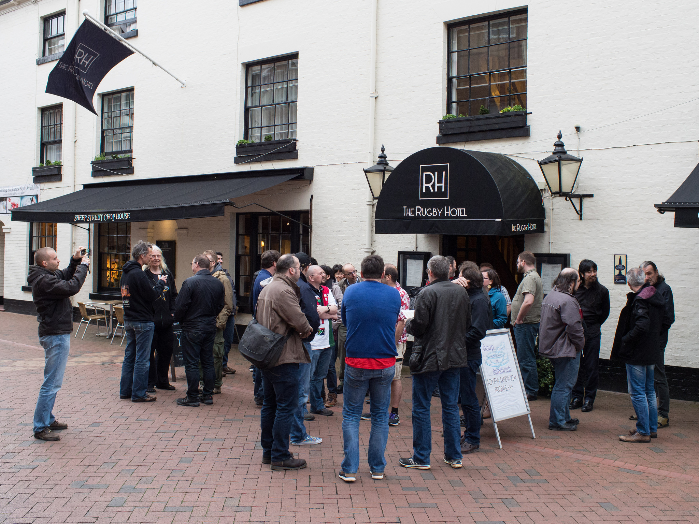

------

# What Got Done

<http://act.qa-hackathon.org/qa2016/wiki?node=Results>

---

# PAUSE

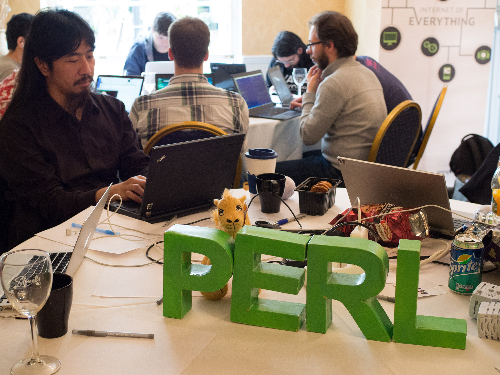

---

# MetaCPAN

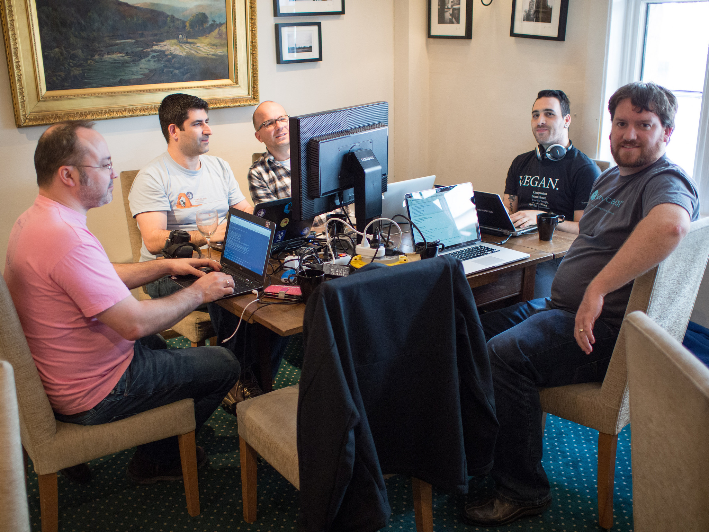

---

# Perl 6

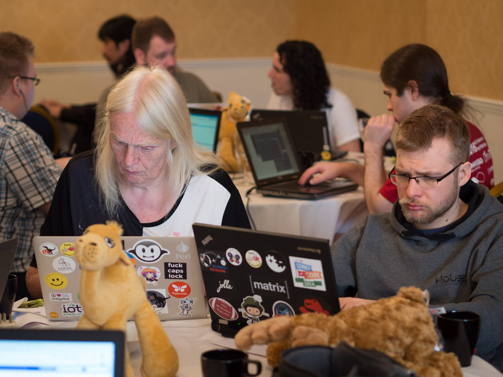

---

# Metaconfig

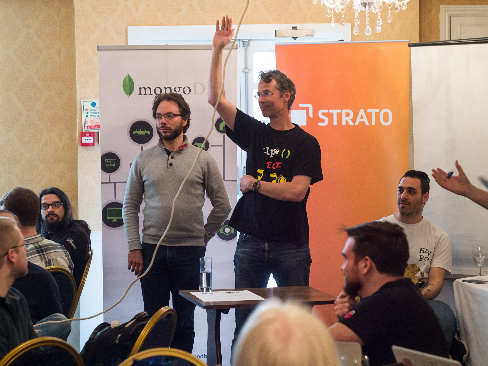

---

# CPANTesters

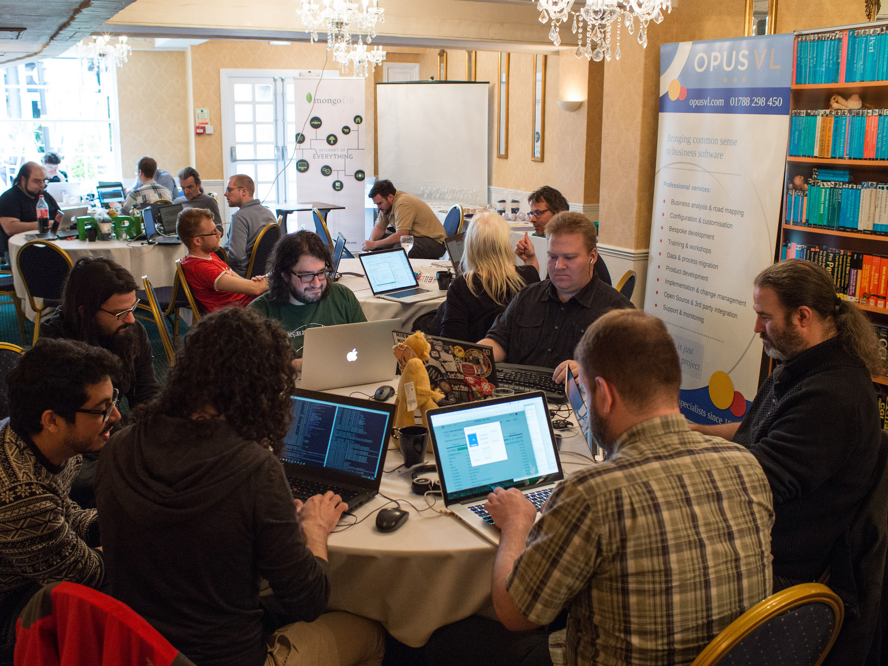

---

# Perl

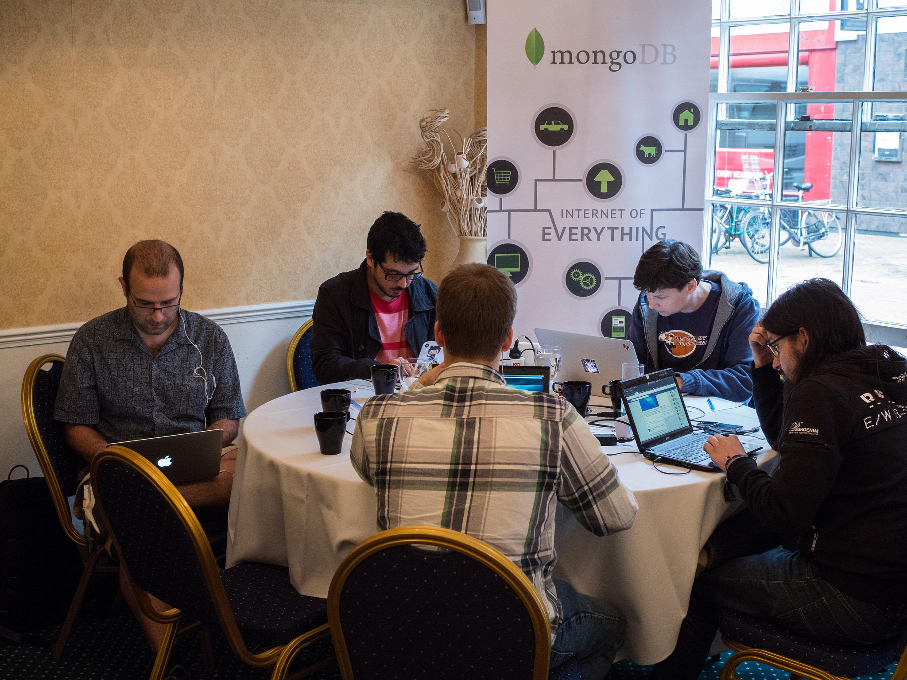

---

# Test2

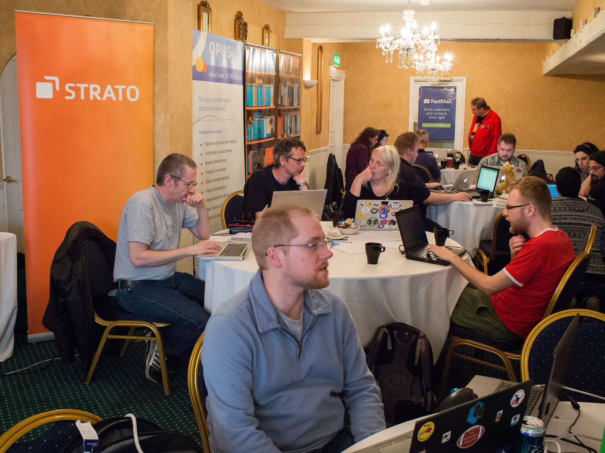

---

# CPAN River

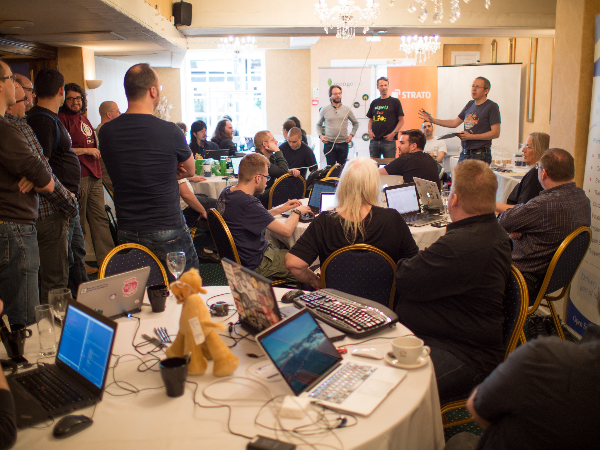

---

# And Lots More!

<http://act.qa-hackathon.org/qa2016/wiki?node=Results>

---

# Together

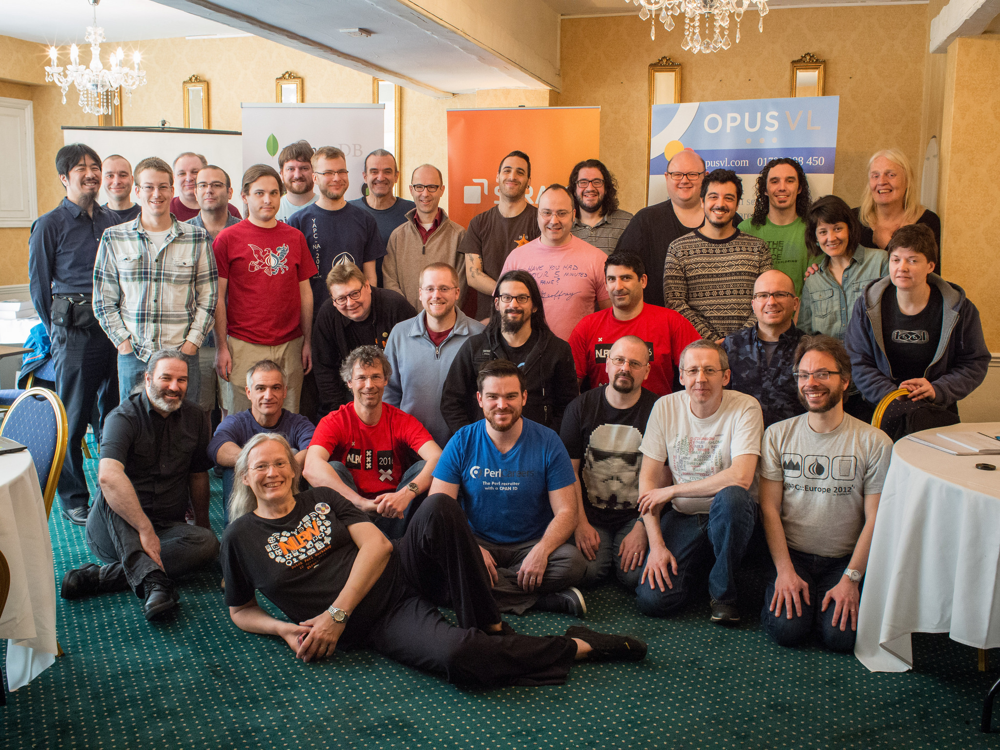

------

# Thanks

---

# Ricardo

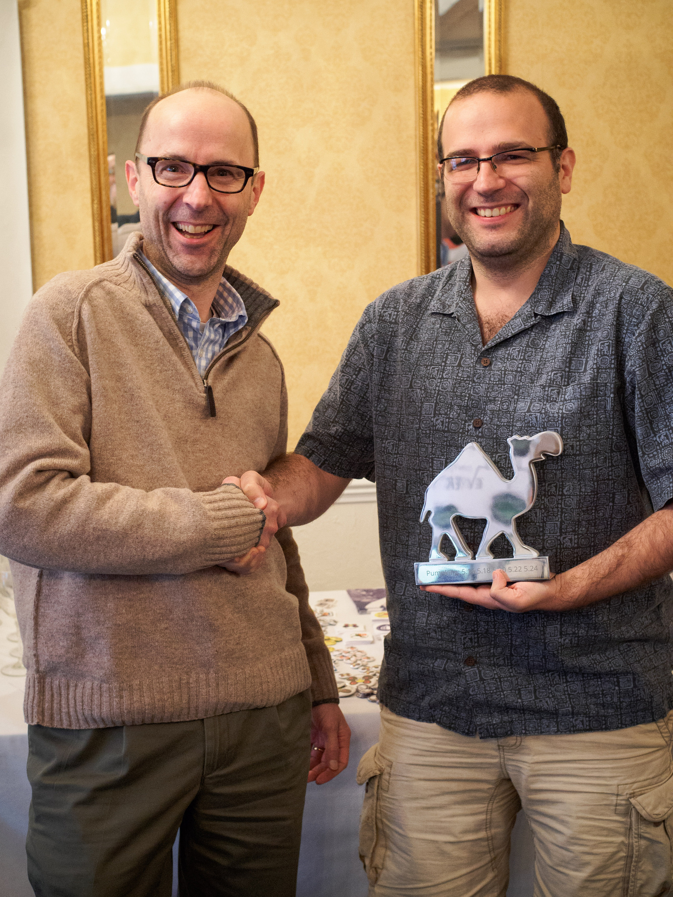

---

# Sponsors

<http://act.qa-hackathon.org/qa2016/sponsors.html>

FastMail, ActiveState, ZipRecruiter, Strato, SureVoIP, CV-Library,
OpusVL, thinkproject!, MongoDB, Infinity, Dreamhost, Campus Explorer,
Perl 6, Perl Careers, Evozon, Booking, Eligo, Oetiker+Partner, CAPSiDE,
Perl Services, Procura, Constructor.io, Robbie Bow, Ron Savage, Charlie
Gonzalez, and Justin Cook

---

# Organizers

Neil Bowers, Barbie, JJ Allen

------

# End of Session 2

